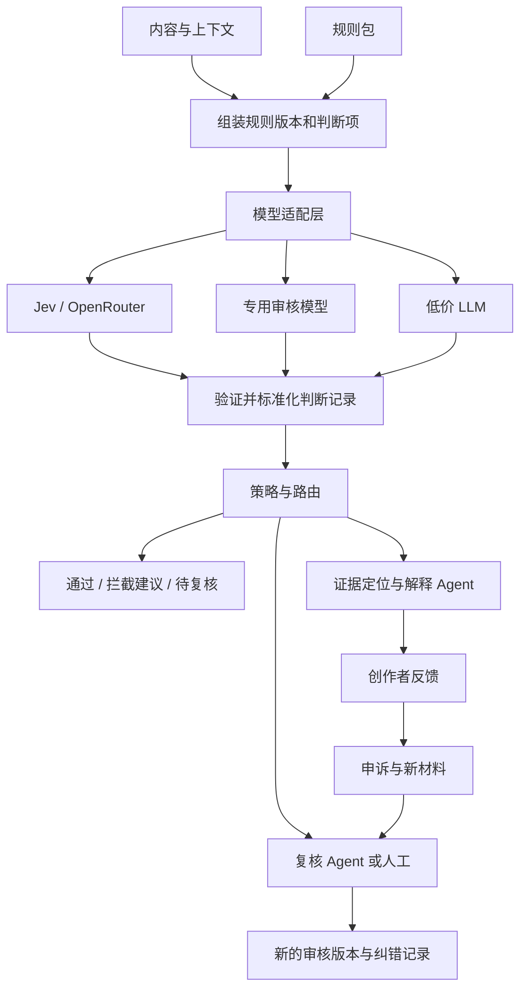

# VerdictLab 项目方案

版本：0.2 · 日期：2026-09-20 · 状态：M1 最小实现，待真实接口探测

## 1. 项目目标

建立一个模型可替换、判断项可配置、评测可复现的内容审核实验项目。首先判断三条技术路线的适用范围和经济性，继而为多模型、多 Agent 的审核服务提供统一接口。

首期交付对比能力，不以训练自有模型为前提。用户具备约 30 多张 H100、可能每张 80GB；型号、互联和可用时长未核实。本项目先调用现有模型，只有在数据证明明确缺口后再设计训练实验。

## 2. 首期研究范围

对象为社区帖子、评论与对话中的文本内容。平台规则是实验输入，而非某个模型内置规则的默认延伸。

覆盖两个规则包：

- **通用内容风险包：** 从候选模型支持的风险类别中选择语义可对齐的子集，如定向攻击、暴力威胁、敏感个人信息暴露。每类给出包含项与例外，不能只凭名称映射。
- **社区运营规则包：** 站外引流、交易板块限制、重复推广、引用与讨论例外等自定义规则。用于观察规则适应能力，不假设专用审核模型原生支持。

首期不做图片 / 视频直接审核、事实核查搜索、真实处罚执行或全自动账号封禁。涉及真实性、授权、重复行为的判断，若输入没有对应材料，应选信息不足并保留后续取证接口。

## 3. 可检验假设

| 编号 | 假设 | 反证方式 |
| --- | --- | --- |
| H1 | Jev 在多项判断时，比低价 LLM 有更低的完整响应延迟 | 同质量约束、同内容与规则下，测不到优势 |
| H2 | 原生概率可降低复核量 | 同误杀漏审约束下，校准后覆盖率未超过其他路线 |
| H3 | 专用审核模型在共同支持的类别上更具性价比 | 完整成本 / 质量被其他路线支配 |
| H4 | 自定义规则可成为决策模型的优势 | 换规则后不稳定，或必须借助昂贵解释 / 复核才可用 |
| H5 | 分项判断与证据能改善创作者反馈 | 人工盲评发现理由不受证据支持，或用户误解概率 |

每项都允许失败；不把采购模型或训练自有模型当作必然结论。

## 4. 服务结构

图中三条模型支路在评测时处理相同测试实例；生产实验可按策略选择一条，再针对难例升级。不能把每条内容全部调用三遍的评测费用，当作生产必需费用。

### 各环节职责

| 环节 | 输入 | 输出 | 边界 |
| --- | --- | --- | --- |
| 规则配置 / 规则 Agent | 人写规则、例外、标注案例 | 版本化判断项草案 | 发布前审阅；评测中不得临时改规则 |
| 快速判断模型 | 内容、上下文、判断项 | 选项与可用概率 | 不直接执行处罚，不生成内部思考轨迹 |
| 策略与路由 | 判断记录、阈值、业务约束 | 操作建议、升级原因 | 优先可审计规则；不能把分布随意相加 |
| 证据定位环节 | 原文、判断项 | 原文片段与规则引用 | 可用片段选择或额外模型；额外费用单列 |
| 解释 Agent | 规则、已验证片段、判断与路由依据 | 面向创作者的解释 | 不创造新的违规理由；新发现必须触发重新审核 |
| 复核 Agent / 人工 | 低确定性、模型分歧、缺失材料 | 覆核结论与证据 | 保留旧结论；不得无声覆盖 |
| 申诉 Agent | 创作者说明、新材料、原审核记录 | 申诉摘要、补充取证需求 | 申诉后的结果形成新版本 |
| 离线分析 Agent | 已脱敏判断、申诉和人工标注 | 错误聚类、改进建议 | 不自动拿未经验证的模型输出当真值训练 |

## 5. 对比工作台的使用流程

1. 输入一条内容及上下文，或导入同结构的批量样本。
2. 选择规则包与版本；编辑判断项、候选选项、正反例及适用范围。
3. 选择三类候选模型，查看哪些判断项是原生支持、映射支持或不支持。
4. 选择“仅判断”或“判断与分布”赛道，预估费用、显示本轮预算上限。
5. 运行后并列展示选项、分布来源、原始输出、耗时与成本。
6. 有人工真值时展示错误；没有真值时仅显示分歧，不把多数票称为正确答案。
7. 可进入服务实验，使用相同解释与复核配置，比较最终成本和创作者反馈。
8. 导出实验配置、结果表和差异报告，支持按版本重现。

工作台是下一阶段的产品规划；本阶段不选前端框架、不实现页面。

## 6. 创作者反馈设计

创作者应能回答：哪条内容、哪个片段、依据哪条规则、为何进入这个处理流程、有什么可补充或申诉的渠道。

展示顺序：

1. 当前处理状态及是否仍在复核。
2. 已核验的内容片段和适用规则版本。
3. 被选中的判断项 / 理由码及简洁解释。
4. 可展开的各判断项选项分布，以及模型、概率来源、校准状态。
5. 针对规则目的的修改建议或申诉入口。

概率不写成“你有 82% 的概率违规”之类的事实断言。可写“在这些选项中，模型给‘站外引流’的估计权重为 82%；这是模型判断，支持补充材料复核”。若未经业务数据校准，应明确标注。

如果模型只输出类别，没有概率，展示“该模型未提供”；如果无可核验片段，不能生成看似具体的引文。不可从结论倒推并编造证据。替换解释模型不能改变既有决策；需要改判则新建审核版本。

概率、解释不是 Jev 独占功能：比较的是获取这些能力的质量和完整成本。

## 7. 三层实验边界

| 层级 | 研究内容 | 公平要求 |
| --- | --- | --- |
| 单模型判断 | 选项准确性、覆盖范围、输出合法性、延迟、调用费用 | 无解释 Agent，无补充检索 |
| 概率与分流 | 概率来源、校准、阈值下的自动处理覆盖率 | 单独校准集，冻结阈值，缺失能力不伪造 |
| 完整审核服务 | 判断 + 证据 + 解释 + 升级 + 申诉处理 | 相同下游组件先做受控对比，再分别优化 |

禁止把单模型的便宜价格与另一条完整服务链路的总价格作对比。Agent 链路引入的错误、费用和延迟也需要归因。

## 8. 实施阶段及交付物

| 阶段 | 工作 | 完成标准 |
| --- | --- | --- |
| M0 文档 | 本次 README、判断契约、评测方案、资料核查 | 文档自洽，可交给实现者执行；不写应用代码 |
| M1 接口探测 | 先对 OpenRouter Jev 与 DeepSeek 官网 Flash 做少量调用；专用审核模型后续加入 | 保存真实请求响应、计费、权限、缺失能力；两条核心路线可比较 |
| M2 试验集 | 约 200 条人工核验实例；迭代判断项、完成兼容映射 | 明确能力不支持项；没有测试集泄漏 |
| M3 冻结评测 | 按评测方案建立独立测试集；跑质量、并发和成本 | 原始结果、置信区间、错误分析、规则变化报告 |
| M4 服务实验 | 接证据、解释与复核流程，做创作者反馈盲评 | 算清完整成本，识别值得自动化的类别 |
| M5 决策 | 比较供应商接入、自部署、微调及继续观察 | 输出采用 / 混合 / 不采用建议；训练需另立实验 |

时间和费用在 M1 获得真实吞吐后估计，不以显卡数量推算交付日期。

## 9. 何时值得继续

先在开发集约定业务质量门槛、延迟预算和最低实际收益，再冻结到测试集。可把“同质量下完整成本下降至少 30%”作为待讨论的试点目标，而非已承诺优势。

报告至少给出以下三种结论之一：

- 某一条路线在目标场景中明确优于基线，推荐采用。
- 不同类别的最佳模型不同，推荐混合路由并报告总收益。
- 收益不足、样本不足或能力不支持，暂不扩大投入。

不能用总体均值掩盖少数关键类别严重退步，也不能凭一个价格截图宣称最低成本。

## 10. 仍需在实施前落实

- OpenRouter Jev 的实际账户可用性、正式请求形状及原生分布返回情况。
- 首个目标客户 / 社区规则、可用标注数据及合理的漏审误杀要求。
- 低价模型实际供应商、稳定版本、价格条件和输出模式。
- 自部署审核模型所需的硬件配置、许可证和实际运行成本。
- API 测试预算与数据使用范围；本阶段不读取密钥或发送真实创作者内容。

细节分别见 [判断契约](JUDGMENT-CONTRACT.md)、[评测方案](BENCHMARK.md) 和 [资料核查](MODELS-AND-SOURCES.md)。
